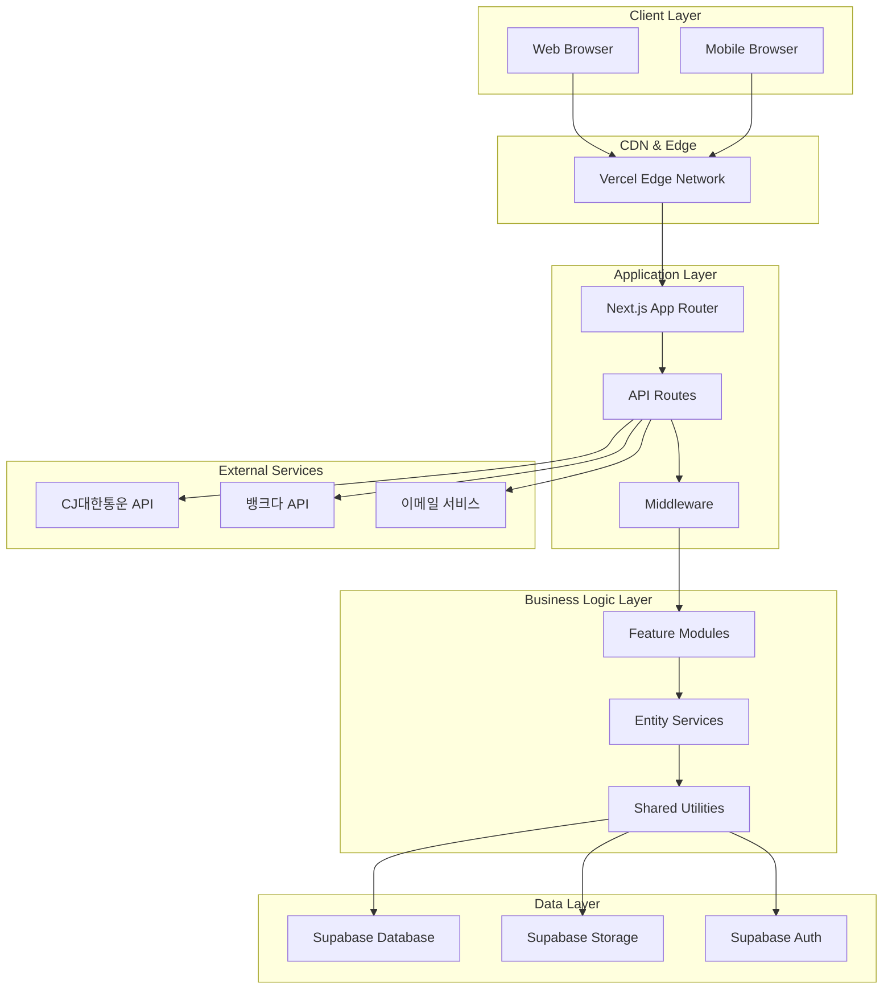
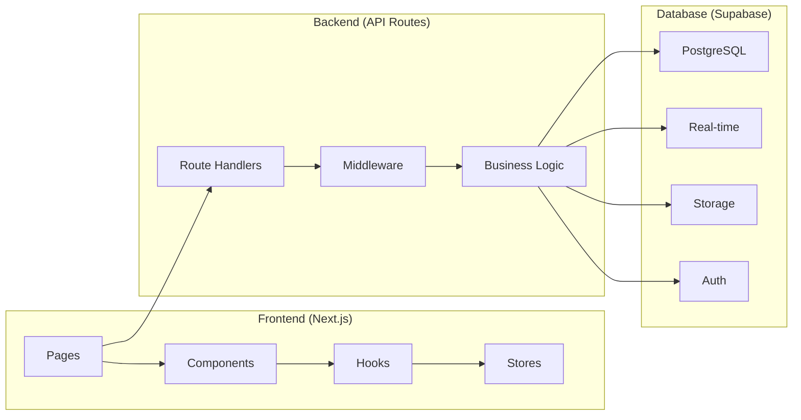
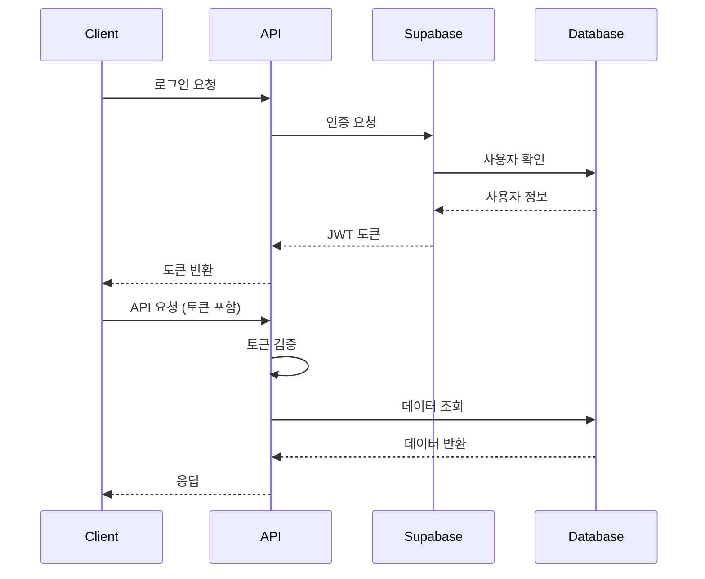
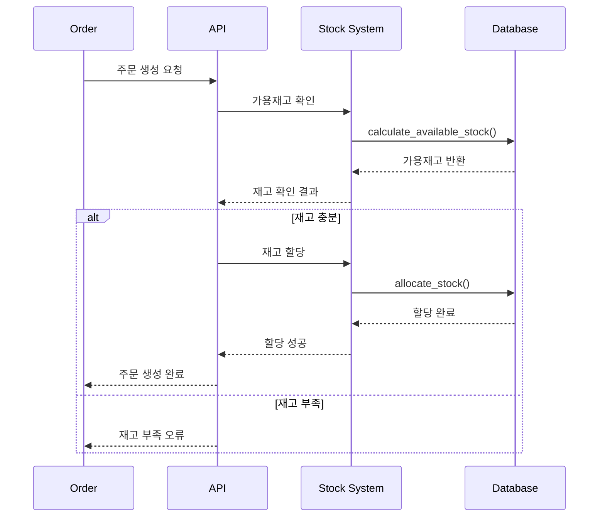
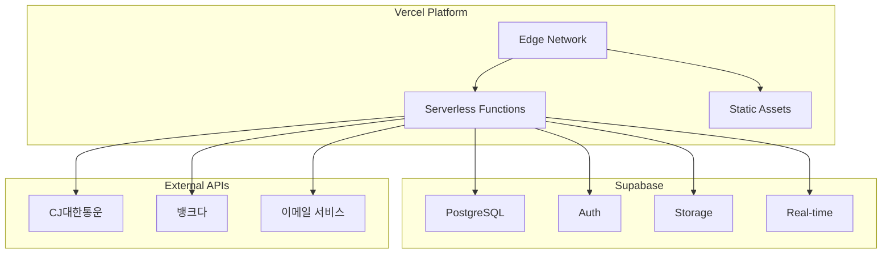
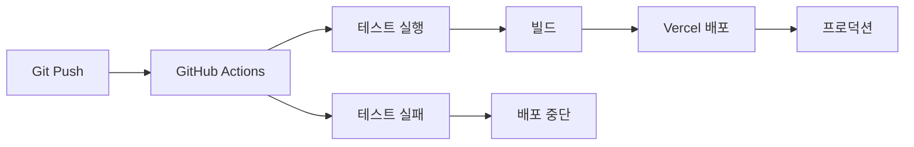
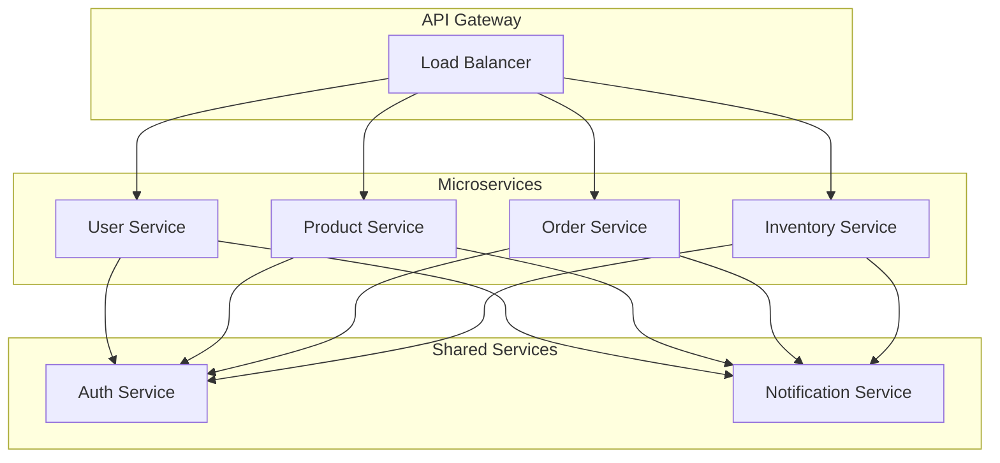

# 루소 도매 시스템 아키텍처 문서

이 문서는 루소 도매 시스템의 전체 아키텍처와 설계 원칙을 설명합니다.

## 📋 목차

1. [시스템 개요](#시스템-개요)
2. [아키텍처 다이어그램](#아키텍처-다이어그램)
3. [기술 스택](#기술-스택)
4. [데이터베이스 설계](#데이터베이스-설계)
5. [API 설계](#api-설계)
6. [인증 및 보안](#인증-및-보안)
7. [재고 관리 시스템](#재고-관리-시스템)
8. [배포 아키텍처](#배포-아키텍처)
9. [성능 최적화](#성능-최적화)
10. [모니터링 및 로깅](#모니터링-및-로깅)

## 🏗 시스템 개요

### 비즈니스 도메인

루소 도매 시스템은 도매법인을 위한 통합 ERP 시스템으로, 다음과 같은 핵심 비즈니스 영역을 다룹니다:

- **고객 관리**: 도매 고객의 승인, 관리, 등급 시스템
- **상품 관리**: 상품 등록, 카테고리 관리, 가격 정책
- **재고 관리**: 실시간 재고 추적, 입고/출고, ADU 분석
- **주문 관리**: 주문 처리, 시간순 할당, 출고 관리
- **마일리지 시스템**: 적립/차감, 명세서 관리
- **샘플 관리**: 무료 샘플 주문 및 반납 관리

### 시스템 특징

- **실시간 처리**: 재고 변동, 주문 상태 실시간 업데이트
- **자동화**: 재고 할당, 마일리지 적립, 일일 이월 처리
- **확장성**: 모듈화된 구조로 기능 확장 용이
- **보안**: 역할 기반 접근 제어, 데이터 암호화

## 🎨 아키텍처 다이어그램

### 전체 시스템 아키텍처



### 컴포넌트 아키텍처



## 🛠 기술 스택

### Frontend Stack

| 기술            | 버전    | 용도                      |
| --------------- | ------- | ------------------------- |
| Next.js         | 15.3.4  | React 프레임워크, SSR/SSG |
| React           | 19.0.0  | UI 라이브러리             |
| TypeScript      | 5.x     | 타입 안전성               |
| Tailwind CSS    | 4.x     | 스타일링                  |
| Zustand         | 5.0.5   | 상태 관리                 |
| React Hook Form | 7.59.0  | 폼 관리                   |
| Lucide React    | 0.523.0 | 아이콘                    |

### Backend Stack

| 기술               | 버전   | 용도                         |
| ------------------ | ------ | ---------------------------- |
| Next.js API Routes | 15.3.4 | 서버리스 API                 |
| Supabase           | 2.50.2 | 데이터베이스, 인증, 스토리지 |
| PostgreSQL         | 15+    | 관계형 데이터베이스          |
| Node.js            | 18+    | 런타임 환경                  |

### 개발 도구

| 기술       | 버전  | 용도        |
| ---------- | ----- | ----------- |
| ESLint     | 9.x   | 코드 린팅   |
| Prettier   | -     | 코드 포맷팅 |
| TypeScript | 5.x   | 타입 체킹   |
| Yarn       | 1.22+ | 패키지 관리 |

### 배포 및 인프라

| 기술     | 버전 | 용도                |
| -------- | ---- | ------------------- |
| Vercel   | -    | 호스팅, CDN, 배포   |
| Supabase | -    | 데이터베이스 호스팅 |
| GitHub   | -    | 버전 관리, CI/CD    |

## 🗄 데이터베이스 설계

### 핵심 테이블 구조

#### 사용자 관련

```sql
-- 사용자 테이블
CREATE TABLE users (
  id UUID PRIMARY KEY DEFAULT gen_random_uuid(),
  email VARCHAR(255) UNIQUE NOT NULL,
  password_hash VARCHAR(255) NOT NULL,
  company_name VARCHAR(255) NOT NULL,
  business_number VARCHAR(20) UNIQUE NOT NULL,
  representative_name VARCHAR(100) NOT NULL,
  phone VARCHAR(20) NOT NULL,
  address TEXT NOT NULL,
  postal_code VARCHAR(10) NOT NULL,
  recipient_name VARCHAR(100) NOT NULL,
  recipient_phone VARCHAR(20) NOT NULL,
  business_license TEXT,
  approval_status VARCHAR(20) DEFAULT 'pending',
  is_active BOOLEAN DEFAULT true,
  mileage_balance INTEGER DEFAULT 0,
  created_at TIMESTAMP WITH TIME ZONE DEFAULT NOW(),
  updated_at TIMESTAMP WITH TIME ZONE DEFAULT NOW()
);

-- 관리자 테이블
CREATE TABLE admins (
  id UUID PRIMARY KEY DEFAULT gen_random_uuid(),
  username VARCHAR(50) UNIQUE NOT NULL,
  email VARCHAR(255) UNIQUE NOT NULL,
  password_hash VARCHAR(255) NOT NULL,
  role VARCHAR(20) DEFAULT 'admin',
  created_at TIMESTAMP WITH TIME ZONE DEFAULT NOW()
);
```

#### 상품 관련

```sql
-- 상품 테이블
CREATE TABLE products (
  id UUID PRIMARY KEY DEFAULT gen_random_uuid(),
  name VARCHAR(255) NOT NULL,
  code VARCHAR(50) UNIQUE NOT NULL,
  description TEXT,
  detailed_description TEXT,
  category_id UUID REFERENCES categories(id),
  price DECIMAL(10,2) NOT NULL,
  sale_price DECIMAL(10,2),
  is_on_sale BOOLEAN DEFAULT false,
  is_featured BOOLEAN DEFAULT false,
  is_active BOOLEAN DEFAULT true,
  stock_quantity INTEGER DEFAULT 0,
  inventory_options JSONB,
  unit VARCHAR(20) DEFAULT '개',
  images JSONB DEFAULT '[]',
  main_image_id UUID,
  created_at TIMESTAMP WITH TIME ZONE DEFAULT NOW(),
  updated_at TIMESTAMP WITH TIME ZONE DEFAULT NOW()
);

-- 카테고리 테이블
CREATE TABLE categories (
  id UUID PRIMARY KEY DEFAULT gen_random_uuid(),
  name VARCHAR(100) NOT NULL,
  slug VARCHAR(100) UNIQUE NOT NULL,
  description TEXT,
  parent_id UUID REFERENCES categories(id),
  order_index INTEGER DEFAULT 0,
  is_active BOOLEAN DEFAULT true,
  created_at TIMESTAMP WITH TIME ZONE DEFAULT NOW()
);
```

#### 주문 관련

```sql
-- 주문 테이블
CREATE TABLE orders (
  id UUID PRIMARY KEY DEFAULT gen_random_uuid(),
  user_id UUID REFERENCES users(id) NOT NULL,
  order_number VARCHAR(50) UNIQUE NOT NULL,
  order_type VARCHAR(20) DEFAULT 'normal',
  total_amount DECIMAL(12,2) NOT NULL,
  shipping_fee DECIMAL(10,2) DEFAULT 0,
  status VARCHAR(20) DEFAULT 'pending',
  working_date DATE NOT NULL,
  shipping_name VARCHAR(100) NOT NULL,
  shipping_phone VARCHAR(20) NOT NULL,
  shipping_address TEXT NOT NULL,
  shipping_postal_code VARCHAR(10) NOT NULL,
  notes TEXT,
  created_at TIMESTAMP WITH TIME ZONE DEFAULT NOW(),
  updated_at TIMESTAMP WITH TIME ZONE DEFAULT NOW()
);

-- 주문 아이템 테이블
CREATE TABLE order_items (
  id UUID PRIMARY KEY DEFAULT gen_random_uuid(),
  order_id UUID REFERENCES orders(id) NOT NULL,
  product_id UUID REFERENCES products(id) NOT NULL,
  product_name VARCHAR(255) NOT NULL,
  color VARCHAR(50),
  size VARCHAR(50),
  quantity INTEGER NOT NULL,
  unit_price DECIMAL(10,2) NOT NULL,
  total_price DECIMAL(12,2) NOT NULL,
  allocated_quantity INTEGER DEFAULT 0,
  shipped_quantity INTEGER DEFAULT 0,
  created_at TIMESTAMP WITH TIME ZONE DEFAULT NOW()
);
```

#### 재고 관련

```sql
-- 재고 변동 이력 테이블
CREATE TABLE stock_movements (
  id UUID PRIMARY KEY DEFAULT gen_random_uuid(),
  product_id UUID REFERENCES products(id) NOT NULL,
  movement_type VARCHAR(50) NOT NULL,
  quantity INTEGER NOT NULL,
  color VARCHAR(50),
  size VARCHAR(50),
  notes TEXT,
  reference_id UUID,
  reference_type VARCHAR(50),
  created_at TIMESTAMP WITH TIME ZONE DEFAULT NOW()
);
```

### 데이터베이스 함수

#### 재고 관리 함수

```sql
-- 물리적 재고 추가/차감
CREATE OR REPLACE FUNCTION add_physical_stock(
  p_product_id uuid,
  p_color varchar DEFAULT NULL,
  p_size varchar DEFAULT NULL,
  p_additional_stock integer DEFAULT 0,
  p_reason text DEFAULT ''
) RETURNS boolean;

-- 재고 할당
CREATE OR REPLACE FUNCTION allocate_stock(
  p_product_id uuid,
  p_quantity integer,
  p_color varchar DEFAULT NULL,
  p_size varchar DEFAULT NULL
) RETURNS boolean;

-- 가용재고 계산
CREATE OR REPLACE FUNCTION calculate_available_stock(
  p_product_id uuid,
  p_color varchar DEFAULT NULL,
  p_size varchar DEFAULT NULL
) RETURNS integer;
```

## 🔌 API 설계

### RESTful API 구조

#### API 엔드포인트 패턴

```
/api/{domain}/{resource}/{action}
```

#### 도메인별 API 구조

##### 인증 API

```
POST /api/auth/login          # 로그인
POST /api/auth/register       # 회원가입
POST /api/auth/logout         # 로그아웃
POST /api/auth/refresh        # 토큰 갱신
```

##### 관리자 API

```
GET    /api/admin/users                    # 사용자 목록
POST   /api/admin/users                    # 사용자 생성
GET    /api/admin/users/[id]               # 사용자 상세
PUT    /api/admin/users/[id]               # 사용자 수정
DELETE /api/admin/users/[id]               # 사용자 삭제
POST   /api/admin/users/[id]/approve       # 사용자 승인

GET    /api/admin/orders                   # 주문 목록
POST   /api/admin/orders/allocate-inventory # 재고 할당
GET    /api/admin/inventory                # 재고 현황
POST   /api/admin/inventory/upload         # 재고 업로드
```

##### 주문 API

```
POST /api/orders                # 주문 생성
POST /api/orders/purchase       # 발주서 생성
POST /api/orders/sample         # 샘플 주문
GET  /api/orders/[id]           # 주문 상세
PUT  /api/orders/[id]           # 주문 수정
```

### API 응답 형식

#### 성공 응답

```typescript
{
  success: true,
  data: any,
  message?: string,
  pagination?: {
    page: number,
    limit: number,
    total: number,
    totalPages: number
  }
}
```

#### 에러 응답

```typescript
{
  success: false,
  error: string,
  details?: any
}
```

### API 보안

#### 인증 방식

- **관리자**: JWT 토큰 기반 인증
- **사용자**: Supabase Auth 기반 인증

#### 권한 제어

```typescript
// 미들웨어에서 권한 확인
export async function requireAdmin(request: NextRequest) {
  const token = request.cookies.get("admin-token")?.value;

  if (!token) {
    throw new Error("인증이 필요합니다.");
  }

  const admin = await verifyAdminToken(token);
  if (!admin) {
    throw new Error("유효하지 않은 토큰입니다.");
  }

  return admin;
}
```

## 🔐 인증 및 보안

### 인증 아키텍처



### 보안 정책

#### 데이터 암호화

- **전송 중**: HTTPS/TLS 1.3
- **저장 시**: Supabase 암호화
- **비밀번호**: bcrypt 해싱

#### 접근 제어

- **RLS (Row Level Security)**: 데이터베이스 레벨 보안
- **API 레벨**: 역할 기반 접근 제어
- **클라이언트 레벨**: 컴포넌트별 권한 확인

## 📦 재고 관리 시스템

### 이중 재고 구조

```typescript
interface InventoryOption {
  color: string;
  size: string;
  physical_stock: number; // 실제 물리적 재고
  allocated_stock: number; // 할당된 재고 (주문에 예약된 재고)
  stock_quantity: number; // 가용재고 (physical_stock - allocated_stock)
}
```

### 재고 할당 플로우



### Working Date 시스템

#### 시간 기준 로직

```typescript
function calculateWorkingDate(): string {
  const now = new Date();
  const koreaTime = new Date(
    now.toLocaleString("en-US", { timeZone: "Asia/Seoul" })
  );
  let workingDate = new Date(koreaTime);
  const originalDayOfWeek = koreaTime.getDay();

  // 15시 이후면 다음날로 설정
  if (koreaTime.getHours() >= 15) {
    workingDate.setDate(workingDate.getDate() + 1);
  }

  // 주말 처리
  if (originalDayOfWeek === 6) {
    // 토요일
    workingDate.setDate(workingDate.getDate() + 2);
  } else if (originalDayOfWeek === 0) {
    // 일요일
    workingDate.setDate(workingDate.getDate() + 1);
  } else if (originalDayOfWeek === 5 && koreaTime.getHours() >= 15) {
    // 금요일 15시 이후
    workingDate.setDate(workingDate.getDate() + 2);
  }

  return workingDate.toISOString().split("T")[0];
}
```

## 🚀 배포 아키텍처

### Vercel 배포 구조



### CI/CD 파이프라인



### 환경 관리

#### 환경별 설정

- **Development**: 로컬 개발 환경
- **Preview**: PR별 미리보기 환경
- **Production**: 운영 환경

#### 환경 변수 관리

```bash
# 개발 환경
NEXT_PUBLIC_SUPABASE_URL=dev_url
NEXT_PUBLIC_SUPABASE_ANON_KEY=dev_key

# 운영 환경
NEXT_PUBLIC_SUPABASE_URL=prod_url
NEXT_PUBLIC_SUPABASE_ANON_KEY=prod_key
```

## ⚡ 성능 최적화

### 프론트엔드 최적화

#### 코드 스플리팅

```typescript
// 동적 임포트
const UserManagement = dynamic(() => import("./UserManagement"), {
  loading: () => <div>로딩 중...</div>,
  ssr: false,
});
```

#### 이미지 최적화

```typescript
import Image from "next/image";

<Image
  src="/images/product.jpg"
  alt="상품 이미지"
  width={300}
  height={300}
  priority={isAboveFold}
  placeholder="blur"
  sizes="(max-width: 768px) 100vw, 50vw"
/>;
```

#### 상태 관리 최적화

```typescript
// Zustand 스토어 최적화
const useUserStore = create<UserStore>((set, get) => ({
  users: [],
  isLoading: false,

  // 메모이제이션된 셀렉터
  getApprovedUsers: () => {
    const { users } = get();
    return users.filter((user) => user.approval_status === "approved");
  },

  // 액션 최적화
  setUsers: (users) => set({ users }),
  setLoading: (isLoading) => set({ isLoading }),
}));
```

### 백엔드 최적화

#### 데이터베이스 최적화

```sql
-- 인덱스 생성
CREATE INDEX idx_users_approval_status ON users(approval_status);
CREATE INDEX idx_orders_working_date ON orders(working_date);
CREATE INDEX idx_order_items_product_id ON order_items(product_id);

-- 복합 인덱스
CREATE INDEX idx_orders_user_status ON orders(user_id, status);
```

#### API 최적화

```typescript
// 페이지네이션
const { data, error, count } = await supabase
  .from("users")
  .select("*", { count: "exact" })
  .range((page - 1) * limit, page * limit - 1)
  .order("created_at", { ascending: false });

// 필요한 필드만 선택
const { data } = await supabase
  .from("users")
  .select("id, company_name, email, approval_status")
  .eq("is_active", true);
```

### 캐싱 전략

#### 클라이언트 사이드 캐싱

```typescript
// React Query 캐싱
const { data } = useQuery({
  queryKey: ["users", page, search],
  queryFn: () => fetchUsers({ page, search }),
  staleTime: 5 * 60 * 1000, // 5분
  cacheTime: 10 * 60 * 1000, // 10분
});
```

#### 서버 사이드 캐싱

```typescript
// Next.js 캐싱
export const revalidate = 3600; // 1시간

export async function GET() {
  const data = await fetchData();
  return Response.json(data);
}
```

## 📊 모니터링 및 로깅

### 로깅 전략

#### 구조화된 로깅

```typescript
// API 로깅
export function logApiCall(
  method: string,
  url: string,
  status: number,
  duration: number,
  userId?: string
) {
  console.log(
    JSON.stringify({
      timestamp: new Date().toISOString(),
      level: "info",
      service: "api",
      method,
      url,
      status,
      duration,
      userId,
    })
  );
}

// 에러 로깅
export function logError(error: Error, context: string, userId?: string) {
  console.error(
    JSON.stringify({
      timestamp: new Date().toISOString(),
      level: "error",
      service: "api",
      context,
      error: {
        message: error.message,
        stack: error.stack,
      },
      userId,
    })
  );
}
```

### 성능 모니터링

#### 메트릭 수집

```typescript
// API 응답 시간 측정
export function measureApiResponse(handler: Function, endpoint: string) {
  return async (request: NextRequest) => {
    const start = performance.now();

    try {
      const response = await handler(request);
      const duration = performance.now() - start;

      logApiCall(request.method, endpoint, response.status, duration);

      return response;
    } catch (error) {
      const duration = performance.now() - start;

      logError(error as Error, endpoint);

      return NextResponse.json(
        { success: false, error: "서버 오류가 발생했습니다." },
        { status: 500 }
      );
    }
  };
}
```

### 알림 시스템

#### 에러 알림

```typescript
// 심각한 에러 발생 시 알림
export async function sendErrorAlert(error: Error, context: string) {
  if (error.message.includes("database") || error.message.includes("auth")) {
    await sendEmail({
      to: "admin@lusso.com",
      subject: "시스템 오류 알림",
      body: `
        오류 발생: ${error.message}
        컨텍스트: ${context}
        시간: ${new Date().toISOString()}
      `,
    });
  }
}
```

## 🔄 확장성 고려사항

### 수평적 확장

#### 마이크로서비스 전환



### 데이터베이스 확장

#### 샤딩 전략

```sql
-- 사용자별 샤딩
CREATE TABLE users_shard_1 (
  LIKE users INCLUDING ALL
);

CREATE TABLE users_shard_2 (
  LIKE users INCLUDING ALL
);

-- 날짜별 파티셔닝
CREATE TABLE orders_2024_01 PARTITION OF orders
FOR VALUES FROM ('2024-01-01') TO ('2024-02-01');
```

### 캐싱 계층

#### Redis 캐싱

```typescript
// Redis 캐싱 레이어
export class CacheService {
  private redis: Redis;

  async get<T>(key: string): Promise<T | null> {
    const value = await this.redis.get(key);
    return value ? JSON.parse(value) : null;
  }

  async set<T>(key: string, value: T, ttl: number = 3600): Promise<void> {
    await this.redis.setex(key, ttl, JSON.stringify(value));
  }

  async invalidate(pattern: string): Promise<void> {
    const keys = await this.redis.keys(pattern);
    if (keys.length > 0) {
      await this.redis.del(...keys);
    }
  }
}
```

## 📚 결론

루소 도매 시스템은 현대적인 웹 기술 스택을 기반으로 구축된 확장 가능하고 유지보수 가능한 시스템입니다.

### 핵심 설계 원칙

1. **모듈화**: 기능별로 분리된 모듈 구조
2. **확장성**: 수평적/수직적 확장 가능한 아키텍처
3. **보안**: 다층 보안 정책 적용
4. **성능**: 최적화된 데이터 처리 및 캐싱
5. **모니터링**: 포괄적인 로깅 및 모니터링

### 향후 개선 방향

1. **마이크로서비스 전환**: 서비스별 독립 배포
2. **실시간 처리**: WebSocket 기반 실시간 업데이트
3. **AI/ML 통합**: 재고 예측, 추천 시스템
4. **모바일 앱**: React Native 기반 모바일 앱
5. **다국어 지원**: i18n 기반 다국어 지원

이 아키텍처 문서는 시스템의 현재 상태를 반영하며, 지속적인 개선을 통해 더욱 발전된 시스템으로 진화할 것입니다.
